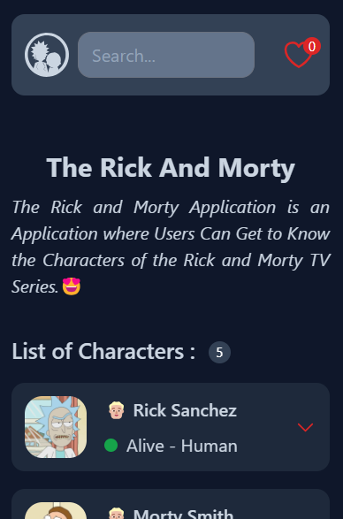
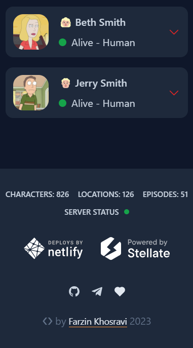
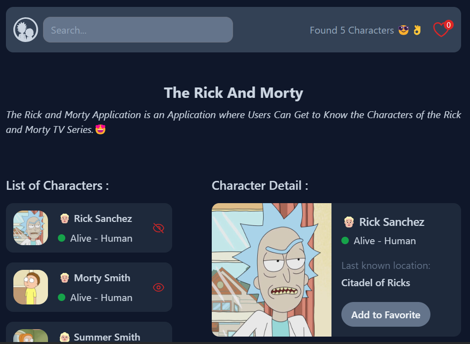
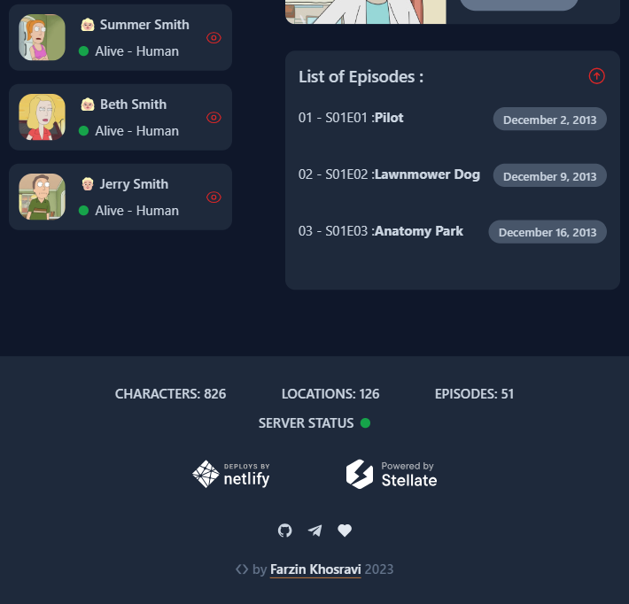
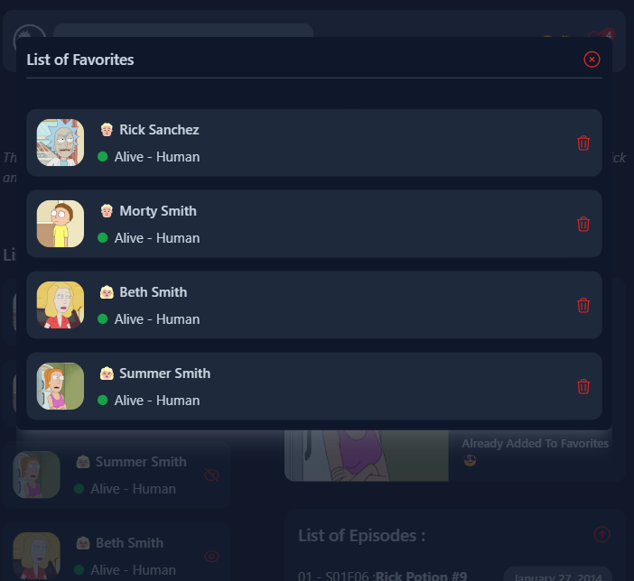

# Rick and Morty App Project 😍 ( React/TailwindCSS )

## App Demo


   
   
   
   
   

---

## Description 📝

The Rick and Morty Application is an Application where Users can get to Know the Characters of the Rick and Morty TV Series.

User can Filter Characters Based on Name and Learn Various Information about Them.

This Project uses The Rick and Morty API to Provide a Beautiful Interface with All the Characters of the Show.

This is an Application Developed with the React.js Library and using the TailwindCSS Framework,
On the other hand, This Project is Set up with Vite.

Which is Responsive in the Screen Sizes of Different Devices;

Also Speed of Work by the Tailwind Framework is very high and it results in an Optimal Output.

## Getting Started 🚀

To get started with this project, follow these steps:

1. Clone this repository to your local machine:

```bash
git clone https://github.com/your-username/Rick-and-Morty-App-React-TailwindCSS.git

```

2. Open the project folder in your code editor.

3. Explore the src folder and check App.jsx file to understand the project structure and styling.

4. In this step, Install the Project Dependencies :

```bash
npm install
```

5. Note that in order to apply Development Server, be sure to enter the following command in the terminal editor:

```bash
 npm run dev
```

## Usage 📋

- Customize the project to match your specific requirements.
- Add your own content and styles.
- Test the responsiveness on various devices and browsers.

## Features ✅

- Filter Characters Based on Name. (API Request with Query String)
- Automatic Deletion Feature of Unnecessary Requests to the Server.
- Display All Characters Filtered and Fetched from the Server.
- Fully Responsive on All Devices with any Screen Size.
- Feature of Adding and Removing Favorite Characters to the Modal.
- Create an Accordion Menu to Display Character Details and Episodes List.
- Feature to Sort List of Episodes.

## Packages 📦

- Axios (For All Server Side Requests)
- React-Hot-Toast (To Display Server Side Errors and Loader)
- HeroIcons/React
- React-Icons
- Prettier Plugin TailwindCSS (To Automatically Sort Tailwind Classes)
- TailwindCSS/Forms (A Plugin that Provides a Basic Reset for Form Styles that Makes Form Elements Easy to Override with Utilities)

## Tips 📌

- Fully Responsive for Mobile, Tablet, Laptop and Desktop.
- Combination of Hooks Context and useReducer is used to Management States.
- Using the Concepts and Principles of AJAX and API Request.
- Using the Concepts and Principles of Clean Code.
- Using the Concepts Component Lifecycle.
- Using the Concepts and Principles React Hooks and Custom Hooks.
- Using the Concepts Local Storage. (To Store and Retrieve Data from the Browser Storage)
- Created API Request Functions and Base URL.

## Web Development Technologies 🪄

- HTML5 (Semantic HTML)
- TailwindCSS (v3)
- React.js (v18)
- Vite
- NPM

## Contact Me 📧

<p>
<a href="https://t.me/Farzin_KHI" target="_blank"></a> <a href="mailto:khosravii.farzin@gmail.com" target="_blank"></a>

</p>
